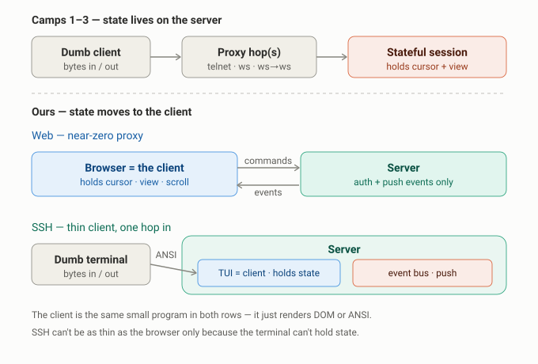

# Architecture: Client/Server Inversion & The Thin-Layer Principle

*Companion to* General Technical Directions, High-Level Technical Decisions, *and* Protocol Definition. *This document captures the single most important conceptual difference between our design and every existing BBS/forum revival — and the precise, sometimes-misstated nuance about what is "thin" in each transport. It supersedes the looser framing of the camps in the directions doc.*

---

## 1. The unifying flaw in all three camps

The existing terminal-BBS landscape splits into three camps, and it's tempting to treat them as three different architectures. They aren't. They're one architecture with three transport wrappers:

- **Camp 1** — the user's terminal connects directly to a terminal session (telnet/SSH, the 1980s–90s model).
- **Camp 2** — the same terminal session, reached through a WebSocket proxy, with richer modern features layered on.
- **Camp 3** — no SSH/telnet at all, but still a terminal session, reached through a double hop: browser terminal → WebSocket → WebSocket → terminal session.

Strip away the transport and the same thing is underneath each one: **a stateful session that lives on the server, driving a dumb client.** The server holds the cursor, the menu position, the "where am I" view state, and does the rendering; the client is just bytes-in/bytes-out. Camps 1–3 differ only in *how many hops sit between the dumb client and that server-side session.* The transport got more modern; the architecture never changed. In the end, all three are doing the same thing — running terminal sessions.

We do not want to do this.

---

## 2. The inversion

Our design turns the relationship inside out. **Session state moves to the client. The server becomes near-stateless per connection** — its job collapses to "authenticate this connection to an account, and stream it the events its cursor is owed." It does not remember that you're three levels deep in a menu or scrolled halfway down a thread. *The client* knows that, because the client is now a real program holding its own state, not a glorified screen.

Both clients are **peers** of one append-only event log. Neither is privileged; neither is a hack bolted onto the other. (See *High-Level Technical Decisions*, Decision 2, for the log/cursor model this rests on.)

The server underneath is identical for both clients and minimal: a command handler that validates and appends, a pub/sub broadcaster that fans events out, and the log itself. Everything that used to be a "session" — cursor, view, navigation — is gone from the server and now lives client-side.

---

## 3. The precise nuance: proxy-thin vs. client-thin

Here is the part that is easy to state imprecisely and worth nailing down before writing any transport code.

It is correct that, compared to camps 1–3, *both* of our transports are dramatically thinner — there is no heavyweight stateful menu-walking session engine anywhere. But the two transports are thin in **different places**, and the difference is a property of the *client endpoint*, not the server.

### Web — the *proxy* is thin (approaching zero)

The browser is a full application runtime. It holds the cursor, the unread state, the current view, the scroll position — all of it, in its own memory. So there is nothing to proxy: the browser **is** the client, end to end, and the server never shadows it with a server-side session object. The "proxy layer" essentially vanishes. The server just authenticates the socket and pushes events.

### SSH — the *client* is thin (but it lives one hop in)

A raw telnet/SSH client (PuTTY, the user's terminal) is genuinely dumb: it cannot hold structured state or run our rendering logic. It only knows bytes in, bytes out. So *something* server-side has to be the real client on that user's behalf — the **server-hosted TUI**. That TUI holds the cursor and view state and subscribes to the event bus exactly like the browser does, and renders ANSI down the pipe.

So the honest statement is: the SSH path is thin because it is a thin **client**, not a thin **proxy**. It runs the same small client program the browser runs — just co-located with the server and emitting ANSI instead of DOM. It is emphatically *not* the stateful session engine of camps 1–3. The state lives one hop in (server-side) rather than at the true endpoint, but conceptually it is *the client*, not *the server*.

The reason SSH can't be as thin as the browser is simply that **the user's actual endpoint — a dumb terminal — can't hold state.** So the state has to live one hop in. That's the entire asymmetry.

### The one sentence that captures it

> The client is the same small program in both cases; only its location and its output format differ. Browser client → renders DOM, lives at the endpoint, near-zero proxy. SSH client → renders ANSI, lives one hop in on the server, thin because it's a client and not a session engine. The server underneath is identical and minimal for both.

This is exactly why the Protocol Definition designates SSH as the **"rendered transport"** — the only transport where a client runs server-side, precisely because the endpoint can't run one itself. Every other transport (browser today, any native client tomorrow) holds its own state and speaks commands-and-events to a thin server.

---

## 4. The code-level consequence: one shared client core

This nuance has a direct, load-bearing implication for how the code is structured — and it's the thing most likely to go wrong if it isn't decided up front.

The client logic — cursor management, view state, command construction, event folding — must live in a **single transport-agnostic core library** that both the browser client and the server-hosted TUI import. If that state logic is written twice (once in the browser, once in the TUI), the two clients *will* drift, and you'll end up maintaining two subtly different clients with two subtly different bugs.

Write the client core once. The browser and the TUI then become **thin renderers** wrapping that shared core — one translating folded state into DOM, the other into ANSI. This is the code-level expression of section 3's one-sentence principle: *the same small program in both cases.* The renderer is the only part that differs.

A practical note on language choice (see directions doc, §6): if the server and TUI are Go, the client core can be a Go package the TUI imports directly. The browser client is JavaScript/TypeScript and can't import that package — so the *core's behavior* must be pinned by the Protocol Definition (the spec is the shared contract) and ideally by a shared conformance test suite both implementations run against. The protocol is what keeps the JS browser core and the Go TUI core honest with each other; the spec, not the code, is the single source of truth for client behavior across languages.

---

## 5. What this means for the build (Claude Code hand-off)

Carry these into the implementation:

1. **The server is an event source, not a session host.** Resist any urge to keep per-connection navigation/view state server-side. The only per-connection state the server needs is: which account, which cursor, which subscriptions. Everything else belongs to the client.
2. **SSH is the rendered transport — and the only one.** The server-hosted TUI is a *client* that happens to run on the server because the terminal endpoint can't host one. Build it as a client of the same bus, never as a special server mode.
3. **Write the client core once; render twice.** Cursor/view/command/folding logic is shared; DOM vs ANSI is the only divergence. Where languages force two implementations (Go TUI, JS browser), bind them to the Protocol Definition and a shared conformance suite rather than letting each reinvent behavior.
4. **The thinness asymmetry is expected, not a smell.** The browser's near-zero proxy and SSH's one-hop-in client are both correct. Don't try to "fix" SSH to be as thin as the browser — you can't, because the endpoint is dumb, and trying would push state back onto the server and recreate camps 1–3.

The litmus test for whether we've held the line: *if the server forgot every connection's view state on restart and clients simply reconnected and re-rendered from their cursors, nothing should break.* If that's true, the inversion is intact.
