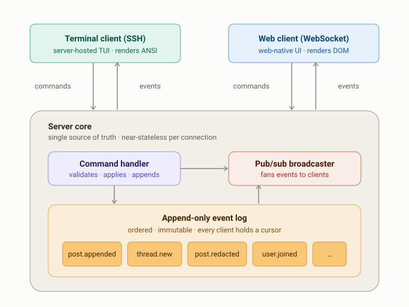
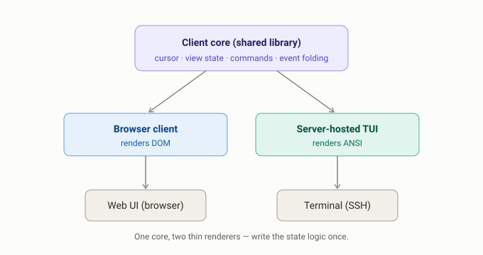

# Architecture

This document is the canonical short architecture record for BudgieBBS. Older
root-level notes about general direction, high-level decisions, client/server
inversion, Reddit real-time tradeoffs, and ranking experiments have been folded
into this file.

## Spine

BudgieBBS is an event-log/CQRS forum:

- Clients send commands; clients do not append durable events directly.
- The command handler is the authority path for validation, permissions,
  idempotency, moderation, and rate limits.
- Accepted commands append durable events to an ordered log.
- Projection tables are derived read models and can be rebuilt from the log.
- Live delivery is a convenience path; reconnect/replay from the durable log is
  the repair path.

## Client/Server Model

The server is an event source and command authority, not a menu-session host.
It should not remember per-connection navigation state such as "which screen is
open" or "where the user has scrolled." Client state belongs to clients.

The browser client runs at the endpoint and renders DOM. The SSH client is the
server-hosted TUI because a terminal endpoint can only speak bytes, but the TUI
is still conceptually a client of the same event stream.

The useful one-sentence rule:

> The client is the same small program in both cases; only its location and
> output format differ.

## Transport Ladder

The same cursor model spans every transport:

- HTTP polling and long-polling for simple clients and diagnostics.
- SSE for one-way push with HTTP reconnection semantics.
- WebSocket for bidirectional live web sessions.
- SSH TUI for zero-install terminal access.
- NNTP for old-school gateway access when enabled.

Every live transport must tolerate duplicate events and repair gaps by replaying
from the durable event log.

## Content Model

Posts use medium-neutral markup, not terminal bytes or arbitrary HTML. The web
client renders markup as responsive DOM; the TUI renders the same semantics as
ANSI. ANSI art is a separate content type with fixed geometry, not the universal
post body format.

## Moderation Model

Moderation is event-sourced:

- Redaction, restore, lock, move, sanction, and role changes are commands that
  emit audit-friendly events.
- User-facing projections hide or tombstone moderated content.
- The durable log preserves enough history for moderator audit.
- Any hard-delete or payload overwrite path must be explicit, admin-only, and
  itself auditable.

## Ranking And Scale

Live delivery stays chronological. Ranking, search, hot feeds, and global views
are derived projections over the event log. That prevents ranked views from
reordering underneath a live reader and keeps scale work out of the command
path.

For very hot objects, the scale path is to tier delivery and reads: keep the
durable log authoritative, use broker delivery for low-latency wakeups, and use
cacheable/read-optimized projections for large audiences.

## Implementation Guardrails

- Keep SQLite single-node mode simple and durable.
- Keep Postgres multi-node mode the ordinary production topology.
- Keep internet-scale dependencies behind interfaces and promotion gates.
- Do not add a new root-level design memo when an existing canonical doc can be
  updated.
- If the server forgot every connection's view state on restart and clients
  reconnected from cursors, the architecture should still work.
