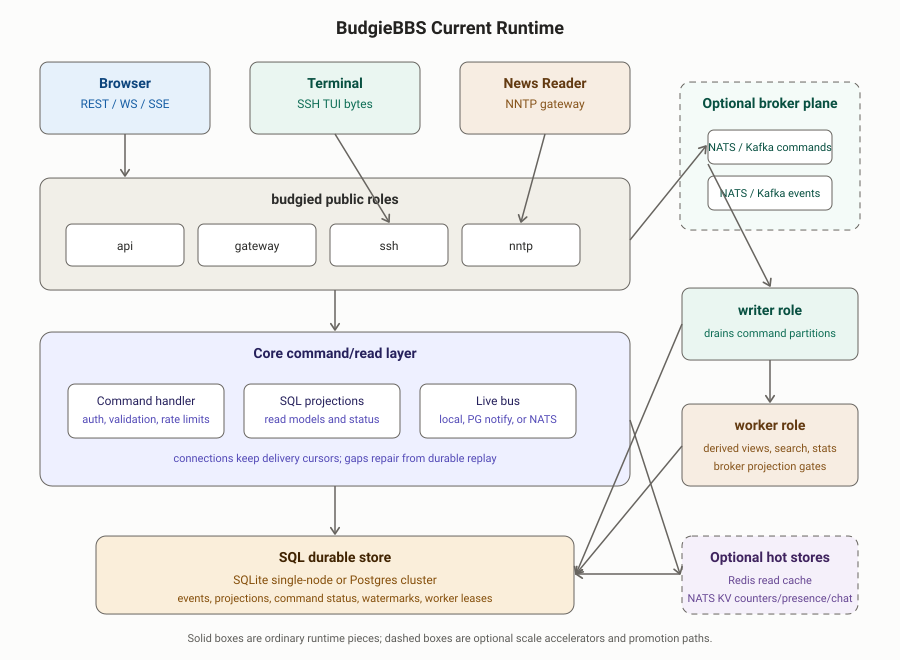

# Architecture

This document is the canonical short architecture record for BudgieBBS. Older
root-level notes about general direction, high-level decisions, client/server
inversion, Reddit real-time tradeoffs, and ranking experiments have been folded
into this file.

## Current Runtime Shape

BudgieBBS is one `budgied` binary with selectable runtime roles:

- `api` serves the full REST API, WebSocket endpoint, and browser bundle.
- `gateway` serves live HTTP transports without the full REST surface; command
  frames are accepted only when an authoritative command log is configured.
- `ssh` serves the terminal TUI.
- `nntp` serves the NNTP gateway when an NNTP address is configured.
- `worker` runs background jobs and derived-view processors.
- `writer` drains the partitioned command log when the internet-scale write path
  is enabled.

Roles can co-reside in a simple single-node deployment, or be split across
processes for a Postgres-backed cluster. The command handler and, in Postgres
mode, the cross-node listener are initialized on every node regardless of role.

## Core Invariant

All durable state mutation flows through the command handler. Transports submit
commands and read projections; they do not write durable events directly.

The accepted command path is:

1. Validate identity, permissions, idempotency, moderation, and rate limits.
2. Choose a write-ordering partition.
3. Append durable events.
4. Update SQL projections and command status.
5. Publish live wakeups.

Projection tables are derived read models. They can be rebuilt from the durable
event log, and live delivery is treated as a convenience path rather than the
source of truth.

## Command Path

BudgieBBS has three command-log modes:

- Direct SQL: the default single-node and ordinary Postgres path. The handler
  executes the command immediately against the SQL-backed event store and
  projections.
- Shadow command log: non-bypassed commands are mirrored into a memory, NATS, or
  Kafka/Redpanda command log while SQL remains authoritative.
- Authoritative command log: public nodes enqueue non-bypassed commands to NATS
  JetStream or Kafka/Redpanda and return a pending ack. Writer nodes drain
  command partitions, execute decisions, append events, and commit offsets.

Some high-volume or ephemeral commands bypass the authoritative command log and
execute on the local handler path: chat lines, presence updates, reactions, poll
votes, read markers, thread preferences, and subscribe/unsubscribe commands.
Those paths still use the command handler and stores configured for the node.

## Event Store And Replay

SQL is the canonical materialized store today. In SQLite mode it is local to one
process. In Postgres mode it is shared by the cluster and also stores
projections, command status, derived-view watermarks, and worker coordination.

The scale path adds broker-backed event-log implementations behind interfaces:

- Event-log shadowing mirrors SQL events into memory, NATS, or Kafka/Redpanda
  and checks parity.
- Event-store projection workers can read a broker event log and project it back
  into SQL.
- Rebuild and promotion-readiness tools can replay from SQL, NATS, or
  Kafka/Redpanda.

Events keep a compatibility scalar `seq` and a partition cursor
`kind/key/offset`. New live clients can repair by partition cursor while older
paths can still replay by scalar sequence.

## Live Delivery

The live bus is a wakeup channel, not the durable log. Each WebSocket or SSE
connection holds its delivery cursor and active subscription scopes. On resume,
duplicate, or gap, it replays from the durable cursor before continuing live
delivery.

Delivery backends are:

- In-process pub/sub for single-node mode.
- Postgres `LISTEN`/`NOTIFY` for sibling-node wakeups in Postgres mode.
- NATS pub/sub when NATS is configured as the cross-node bus.

The same cursor model spans HTTP polling, long-polling, SSE, WebSocket, SSH TUI,
and NNTP gateway reads.

## Read Models, Workers, And Hot Stores

Most reads come from SQL projections. Worker roles can run outbox/stat jobs and
event-log processors for search, community stats, feeds, summaries, rankings,
and derived-view watermarks.

Optional hot-path stores sit behind interfaces:

- Redis can cache stable latest-feed reads.
- NATS KV can hold high-volume unordered counter, presence, and chat stores.
- Meilisearch can replace SQL FTS for post search.

These stores are acceleration layers. The architecture still treats durable
events, projection watermarks, and repair/rebuild paths as the correctness
boundary.

## Client State

The server is an event source and command authority, not a menu-session host.
It should not remember per-connection navigation state such as which screen is
open or where the user has scrolled.

The browser client holds browser view state and renders DOM. The SSH TUI runs on
the server because a terminal endpoint only speaks bytes, but it is still a
client of the same command/event protocol and it owns its own TUI view state.
The browser and TUI do not currently share a literal client library; they share
protocol semantics, cursor rules, command envelopes, and event-folding behavior.

If a server process forgot every connection's view state on restart and clients
reconnected from cursors, the architecture should still work.

## Operating Modes

Single-node mode is the default deployment shape: one `budgied` process, SQLite,
in-process pub/sub, web, SSH, worker, and optional NNTP in the same service.

Postgres multi-node mode shares SQL across nodes and can split public API,
gateway, SSH, worker, writer, and NNTP roles. Without NATS, sibling nodes wake
each other with Postgres notifications; with NATS, cross-node live delivery uses
NATS.

Internet-scale mode promotes partitioned command/event logs and hot stores
behind gates. The goal is to move high-throughput sequencing, wakeups, counters,
presence, chat, search, and cacheable read serving out of the SQL hot path while
keeping replay, parity checks, and projection repair explicit.

## Content And Moderation

Posts use medium-neutral markup, not terminal bytes or arbitrary HTML. The web
client renders markup as responsive DOM; the TUI renders the same semantics as
ANSI. ANSI art is a separate content type with fixed geometry.

Moderation is event-sourced. Redaction, restore, lock, move, sanction, and role
changes are commands that emit audit-friendly events. User-facing projections
hide or tombstone moderated content, while the durable log preserves enough
history for moderator audit. Any hard-delete or payload overwrite path must be
explicit, admin-only, and itself auditable.

## Guardrails

- Keep SQLite single-node mode simple and durable.
- Keep Postgres multi-node mode the ordinary production topology.
- Keep internet-scale dependencies behind interfaces and promotion gates.
- Treat live delivery as lossy and repairable from durable cursors.
- Keep ranked, searched, and global views out of the command hot path.
- Update this canonical document instead of adding new root-level design memos.
